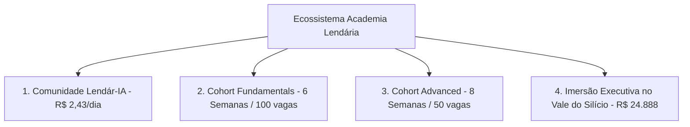

# Dossiê Completo de Web Scraping: Academia Lendár[IA]

> **Origem**: [https://www.academialendaria.ai](https://www.academialendaria.ai)  
> **Data da Extração**: 09 de Setembro de 2026  
> **Arquivo JSON Estruturado**: [`academia_lendaria_scraping.json`](file:///Users/machado/Documents/U.AI/Site%20UAI/Novo%20Site/academia_lendaria_scraping.json)

---

## 1. Visão Geral & Posicionamento

A **Academia Lendár[IA]** é um ecossistema educacional e prático voltado para transformar empresários, profissionais liberais e criadores em operadores autônomos de Inteligência Artificial, substituindo a ideia de "IA como mero chatbot" pelo conceito de **esquadrões de agentes autônomos orquestrados localmente**.

### Números Chave:
- **15.000+** empresários e profissionais em mais de 40 países.
- **50+ Hubs Regionais** presenciais espalhados por 5 continentes (São Paulo, Rio, Lisboa, Miami, Berlim, etc.).
- **20M+** de pessoas alcançadas mensalmente por conteúdos digitais.
- **Framework Proprietário / Open-Source**: **AIOX** (Agentes de Inteligência Operacional Integrada).
- **Pitch de Impacto**: Substituição/economia de custos de equipes tradicionais de desenvolvimento de software e marketing avaliadas em até **R$ 1.6M/ano** com esquadrões de 9 a 80 agentes.

---

## 2. Estrutura de Produtos & Ofertas

### A. Comunidade Lendár[IA] (Always-On)
- **URL**: [https://www.academialendaria.ai/comunidade](https://www.academialendaria.ai/comunidade)
- **Preço**: ~R$ 2,43 por dia (plano anual ~R$ 887 ou mensal ~R$ 73)
- **Garantia**: 30 dias incondicional
- **Proposta**: Ambiente contínuo para networking, tira-dúvidas e atualização constante.
- **Conteúdo Principal**:
  - Acesso à comunidade no **Circle** com 15k+ operadores ativos.
  - Cursos completos e práticos de **Claude Code**, **Codex** e **AIOX**.
  - **Uma nova Skill técnica por semana** ("Aprende na segunda, aplica na terça").
  - Encontro ao vivo quinzenal.
  - **Bônus Especial**: *Squad de Vendas com 9 Agentes de IA* baseado nas metodologias de Neil Rackham (SPIN), Chris Voss, Sandler e Aaron Ross.

---

### B. Cohort Fundamentals (Formação Base)
- **URL**: [https://www.academialendaria.ai/fundamentals](https://www.academialendaria.ai/fundamentals)
- **Formato**: 6 encontros ao vivo (18h) + 12 sessões práticas de destravamento (PS) + 30 dias overdelivery (26+ sessões ao vivo no total).
- **Capacidade**: Turmas limitadas a 100 alunos (ex: Turma 6 com lista de espera).
- **Público**: Empreendedores, advogados, criativos, profissionais sem conhecimento de programação prévio.
- **Objetivo**: Sair de zero linhas de código para um **sistema funcional de captação de clientes operado por agentes autônomos**.
- **Jornada Modular**:
  1. *AIOX e Constituição*: Setup do ambiente e primeiro agente respondendo no terminal.
  2. *Squad Creator & Workflows*: Orquestração de equipes e clones operacionais.
  3. *PRD, Épicos e Memória*: Estruturação de contexto e reaproveitamento open-source.
  4. *SDC & Caminho Infeliz*: Como destravar erros e criar fluxos robustos.
  5. *Mapeamento de SOPs*: Delegação de tarefas repetitivas a agentes customizados.
  6. *Entrega & Formatura*: Sistema de captação rodando em produção.

---

### C. Cohort Advanced (Implementação Corporativa)
- **URL**: [https://www.academialendaria.ai/advanced](https://www.academialendaria.ai/advanced)
- **Formato**: 8 semanas ao vivo, com entregas semanais obrigatórias em 4 fases.
- **Capacidade**: 50 vagas por turma.
- **Garantia**: Condicional de 7 dias (devolução integral se o aluno executar as semanas 1 e 2 e não conseguir rodar o setup).
- **Estrutura**:
  - **Fase 1 (Migração)**: Setup profissional em Claude Code com AIOX.
  - **Fase 2 (Sistema)**: Auditoria de Design System e componentes Atomic.
  - **Fase 3 (Orquestração)**: 80+ agentes em produção, workflows avançados e deploy contínuo em domínio próprio.
  - **Fase 4 (Graduação)**: Apresentação ao vivo do projeto em produção e Certificação oficial *Maestro da IA*.
- **Comparativo AIOX Free vs Pro**:
  - *Free*: 12 agentes básicos, sem squads, deploy manual, suporte de fórum.
  - *Pro (Advanced)*: 80+ agentes especializados, 6 squads premium, loop de QA automático, CI/CD integrado, mentoria e revisão por pares.

---

### D. Imersão Executiva no Vale do Silício
- **URL**: [https://www.academialendaria.ai/vale-do-silicio](https://www.academialendaria.ai/vale-do-silicio)
- **Data**: 06 a 12 de Dezembro de 2026 (Edição 003)
- **Investimento**: **R$ 24.888** (em até 4x sem juros)
- **Vagas**: 20 vagas exclusivas (seleção via aplicação/critérios rígidos de faturamento e inglês).
- **Roteiro Típico**:
  - Visitas imersivas: Google, Apple, NASA, Stanford, Vercel, Circuit Launch.
  - Formato: Manhã (visita técnica) -> Tarde (implementação guiada no negócio do aluno) -> Noite (networking, jantares e eventos esportivos como NBA/49ers).

---

## 3. Ecossistema de Negócios & Marcas

- **Agência Lendar[IA]™**: [agencialendaria.ai](https://agencialendaria.ai/)
- **Super Agentes™**: [superagentes.ai](https://superagentes.ai/)
- **Hub Lendário™**: [hub.lendario.ai](https://hub.lendario.ai/)
- **Newsletter Semanal**: [oalanicolas.news](https://oalanicolas.news/)
- **Biblioteca Lendária**: [biblioteca.academialendaria.ai](https://biblioteca.academialendaria.ai)

---

## 4. Análise de Copywriting & Estratégia de Conversão

1. **Inimigo Comum**: "Cursos teóricos de 200 horas que vendem slides" e "usar IA como se fosse apenas chat".
2. **Transformação Central**: De "espectador/consumidor de tutoriais" para "operador com terminal aberto criando sistemas em produção".
3. **Quebra de Objeção Técnica**: Utiliza repetição sistemática de depoimentos de pessoas sem qualquer bagagem de TI (advogados, militares da reserva, professores) fechando contratos de R$ 8k a R$ 70k.
4. **Escassez e Senso de Tribo**:
   - Turmas com limite estrito (100 alunos no Fundamentals, 50 no Advanced, 20 no Vale).
   - "Tribo das 3 da manhã": Foco em mostrar alunos trabalhando juntos no terminal em horários alternativos.
5. **Garantias Fortes**:
   - 30 dias incondicionais na Comunidade.
   - 7 dias condicionais (com foco em execução) no Cohort Advanced.
